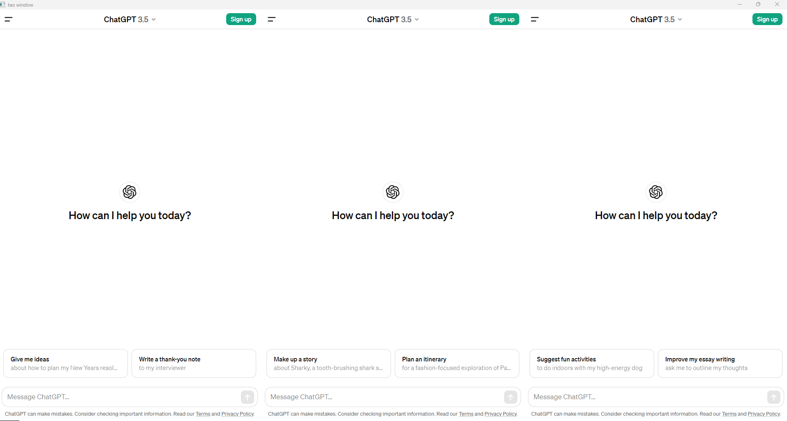

# Multi-LLM Rust App

This is a Rust application that demonstrates the use of multiple Low-Level Modules (LLMs) [chatGpt,Gemini,Claude] in same window at a time.


## Getting Started

These instructions will get you a copy of the project up and running on your local machine for development and testing purposes.

### Prerequisites

You need to have Rust installed on your machine. If you don't have it installed, you can install it using the following command:
 

## Installing
Clone the repository to your local machine:

```
git clone https://github.com/yourusername/multi-llm-rust-app.git
```

Navigate to the project directory:
```
cd multi-llm-rust-app
cargo build
```

To build the executable, run:
```
cargo build --release
```


> The executable will be located in the target/release directory.


## Passing Arguments
You can pass arguments from the command line to change the order of the webview. The arguments are codes for different modules:

- Ch for ChatGPT
- Gi for Gemini
- Cl for Claude

> For example, if you want to order the webview as ChatGPT, Gemini, and then Claude, you would run:

```cmd
multi-llm-rust-app.exe Ch,Gi,Cl
```

Example 2

```cmd
multi-llm-rust-app.exe Ch,Ch,Ch
```



### Trying it

If you would like to try without any installations and code builds, you can download the exe file in the root dir and run it 

[Windows Installer exe](target/release/multi-llm-rust-app.exe)
